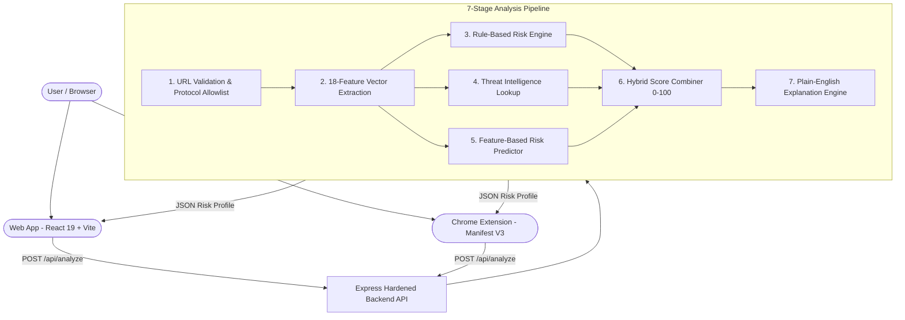

# 🛡️ WebGuard AI — Phishing Risk Detection & Security Awareness

> **One-Line Pitch**:  
> *"WebGuard AI is an explainable URL security system that analyzes suspicious links, combines multiple security signals, and explains to users not only whether a link looks risky, but why."*

[]()
[]()
[]()
[]()

---

## 🧭 Hackathon Presentation & Documentation Index

| Document | Purpose |
| :--- | :--- |
| 📊 [**`PRESENTATION_NOTES.md`**](file:///Users/achantiabhishek/fack%20web%20site%20detector%20AN/PRESENTATION_NOTES.md) | Complete 17-slide pitch deck guide with speaker notes (~5–6 min total). |
| ⚖️ [**`JUDGE_QA.md`**](file:///Users/achantiabhishek/fack%20web%20site%20detector%20AN/JUDGE_QA.md) | 15 grounded technical answers for hackathon judges & evaluators. |
| 🏗️ [**`ARCHITECTURE.md`**](file:///Users/achantiabhishek/fack%20web%20site%20detector%20AN/ARCHITECTURE.md) | In-depth technical specification, data flow, and Mermaid diagrams. |
| ⏱️ [**`DEMO_SCRIPT.md`**](file:///Users/achantiabhishek/fack%20web%20site%20detector%20AN/DEMO_SCRIPT.md) | 2–3 minute timed conversational live demonstration script. |
| 🚢 [**`DEPLOYMENT.md`**](file:///Users/achantiabhishek/fack%20web%20site%20detector%20AN/DEPLOYMENT.md) | Step-by-step production deployment guide for Render, Vercel, and Chrome. |
| 🔒 [**`SECURITY.md`**](file:///Users/achantiabhishek/fack%20web%20site%20detector%20AN/SECURITY.md) | Comprehensive threat model, data minimization, and mitigation details. |

---

## 💡 The Problem
- **Sophisticated Deception**: Modern phishing attacks use subtle tricks like unencrypted IP hosts, homograph punycode, and multi-level subdomains that bypass human visual inspection.
- **Opaque Warnings**: Traditional browser warnings act as black boxes ("Site Dangerous") without explaining *what* was detected, causing alert fatigue and ignored warnings.
- **Delayed Blacklists**: It can take hours or days for newly deployed phishing domains to appear on centralized threat blacklists.

## 🚀 The Solution: "Detect + Explain + Protect"
WebGuard AI inspects URLs through a **7-stage defense-in-depth pipeline**:
1. **Detect**: Evaluates 18 lexical and host indicators combined with optional threat intelligence and feature-based risk modeling.
2. **Explain**: Synthesizes transparent, plain-English reasoning explaining which specific factors caused the score.
3. **Protect**: Provides actionable guidance, dedicated high-risk alert bars, and one-click "Go Back" safe exits on both web and browser extension.

---

## ⚡ Technical Differentiators

1. **Explainable Threat Scoring**: Explains the exact reason a link was flagged rather than outputting a generic score.
2. **18-Feature Vector Pipeline**: Extracts structural, lexical, and host attributes in pure Node.js in under 10ms.
3. **Multi-Signal Hybrid Engine**: Weights local analysis (60%), threat intelligence (25%), and ML feature modeling (15%) with automatic dynamic fallback (85% local) during offline periods.
4. **Honest Threat Intelligence**: Declares `"Local Analysis Mode"` when external API keys are absent, never fabricating fake antivirus hits.
5. **Real-Time Browser Protection**: Manifest V3 Chrome Extension inspects active tabs on demand with minimal permissions.
6. **Privacy-Conscious Architecture**: Strictly passive text inspection. No page fetching, zero user tracking, zero server database.

---

## 🏗️ System Architecture



---

## 💻 Technology Stack

| Layer | Technologies Used |
| :--- | :--- |
| **Frontend** | React 19, Vite 8.2, Vanilla CSS (Design Tokens, Dark Glassmorphism), Lucide Icons |
| **Backend** | Node.js (ESM), Express 4, CORS, dotenv, In-Memory Sliding-Window Rate Limiting |
| **Extension** | Manifest V3, Service Worker, Chrome Storage API, Responsive 360px Popup |
| **Testing** | Native Node.js test runner: 54 Unit Tests + 14 Security Tests (100% Passing) |
| **Deployment** | Vercel / Netlify (Frontend), Render / Railway / Docker (Backend API) |

---

## 🚀 Quickstart & Local Setup

### 1. Clone & Configure Environment
```bash
git clone https://github.com/your-username/webguard-ai.git
cd webguard-ai

# Copy environment templates
cp .env.example .env
cp backend/.env.example backend/.env
cp frontend/.env.example frontend/.env
```

### 2. Run the Backend API
```bash
cd backend
npm install
npm start
```
*Backend runs on `http://localhost:5001`.*

### 3. Run the Frontend Web Application
```bash
cd ../frontend
npm install
npm run dev
```
*Frontend runs on `http://localhost:5173`.*

### 4. Load the Chrome Extension
1. Open Google Chrome and visit `chrome://extensions/`.
2. Enable **Developer mode** (top right).
3. Click **Load unpacked** and choose the `extension/` folder.
4. Click the WebGuard AI shield icon on any open tab to inspect!

---

## 🧪 Automated Test Suites

```bash
# Run backend unit tests (54 tests)
cd backend && node backendTests.js

# Run security & hardening tests (14 tests)
node testSecuritySuite.js

# Build production frontend bundle
cd ../frontend && npm run build
```

---

## ⚠️ Known Limitations & Ethical Notice

- **Passive Analysis**: WebGuard AI analyzes URL strings without executing target page scripts or rendering DOM content. It cannot detect dynamic phishing on compromised legitimate domains that have normal URL structures.
- **No 100% Guarantees**: A low score indicates the absence of known heuristic anomalies, but cannot guarantee a link is completely safe.
- **Threat Intelligence Quotas**: Live reputation checks depend on external provider API availability and rate limits.
